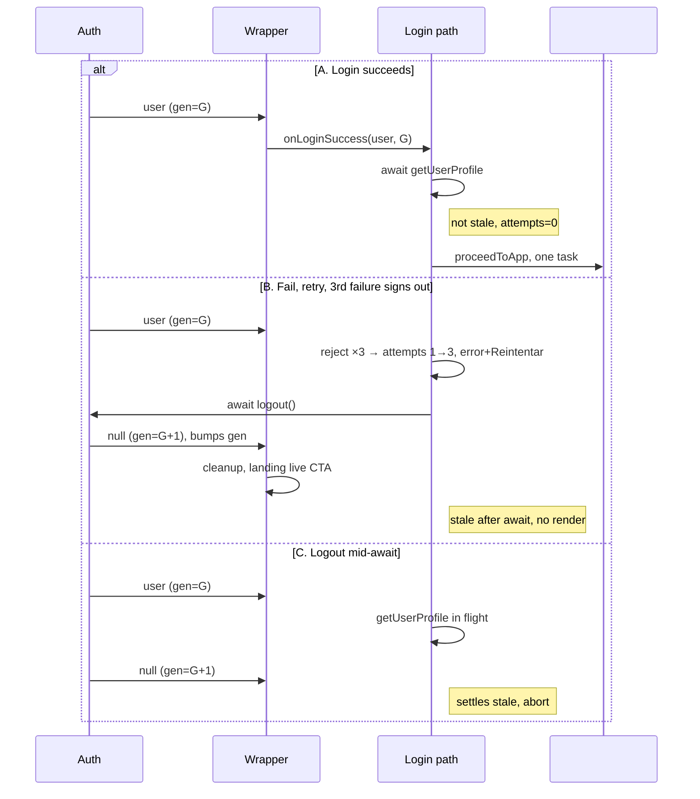

# Design: main-js-hardening

## Technical Approach

`src/main.js` owns the auth-to-app boot: synchronous shell + controller init, generation token across every auth continuation, bounded login-failure retry. `index.html` ships an empty `#app`; `src/services/auth.js` untouched. Covers `app-boot-sequence` + `login-error-recovery`.

## Architecture Decisions

| # | Options | Tradeoff | Decision |
|---|---------|----------|----------|
| A1 Token | Bump at callback entry, both branches / sign-out only / entry-only check | Sign-out-only misses login-side staleness; entry-only check — the naive placement — lets post-`await` continuations run past an auth event | `++authGeneration` at wrapper entry, both branches; `isStale` after **every** `await` (`getUserProfile`, `createUserProfile`, `logout`) and deferred resume (Retry, onboarding), before any DOM write. Sign-out bumps too: that aborts in-flight continuations and satisfies "prior generation stale". Check → `proceedToApp` has no `await`: atomic |
| A2 Sync boot | Inline `setTimeout(…, 50)` / timer + flag / rAF | Timer keeps a multi-task window; rAF waits for nothing | Inline. Verified sync: `initChatArea` (ChatArea.js:5), `initSettingsModal` (:4), `ConfirmModal`, `initAFKMode` (AFKMode.js:22), `initSidebar` (Sidebar.js:8) non-async; `PresenceService.init` (presence.js:23) attaches only RTDB + DOM listeners — none need paint/layout. One task → initialized first paint (today: paint first, init 50 ms later) |
| A3 Counter | Closure var / map / localStorage | Map/storage unused | `loginAttempts = 0` beside `activeAppCleanup`; reset when `getUserProfile` resolves |
| A4 Surface | Inline `#app` / landing button | Button disabled "Cargando Elai..." after popup (D1) | Inline `#app`, Spanish copy. **Revised from "Tailwind utilities" — see Deviations D-A4.** Styles come from the statically imported `src/styles/login-error.css`, not from Tailwind |
| A5 Boundary | `try/catch` + `.catch()` wrapper / edit `AuthService` | `auth.js` out of scope; one layer owns neither job | `try/catch` owns failure UI/retry/sign-out; wrapper absorbs the rest; `auth.js` unchanged |
| A6 Subsumed | `sessionActive` flag / nothing | Dead code under sync boot | Decline "No Controller Initialization After Rapid Logout": shell write + init are one task, logout another — no gap; only `await` boundaries race (A1). Redundant defense is cost, not margin |

## Token Placement and Loop Analysis

```js
let authGeneration = 0, loginAttempts = 0;
const MAX_ATTEMPTS = 3;
const isStale = (g) => g !== authGeneration;
AuthService.onUserChange((user) => {          // non-async wrapper
  const generation = ++authGeneration;         // sign-out bumps too
  (user ? onLoginSuccess(user, generation) : onSignedOut())
    .catch((err) => console.error('Auth callback:', err));
});
```

**Loop verdict: not reachable.** The failure handler runs only in `onLoginSuccess`, only on the truthy-user branch (`src/main.js:127-128`). Sign-out delivers `user === null` → else branch (`:129-140`) does cleanup + landing, never the handler; `auth.js` uses `onAuthStateChanged` only, firing once per state change — no re-entry chain. We do not design against it.

**Real defects the token fixes:** (1) a pending rejection resolving after sign-out renders the error over the landing (rewritten only after the router's 200 ms fade, `router.js:54-68`) — dead-session error + Retry; (2) a pending success resolves into `proceedToApp`, booting a dead session; (3) #7 — the rejection escaping to `onAuthStateChanged`, absorbed by the `.catch()`.

## Sequence Diagram



## File Changes

| File | Action | Description |
|------|--------|-------------|
| `index.html` | Modify | Lines 27-30 → empty `<div id="app"></div>` (D4; `main.js` sole shell source) |
| `src/main.js` | Modify | Drop `setTimeout` (67-103) → sync init; token + stale checks; `failLogin`; `.catch()` wrapper |
| `src/styles/login-error.css` | Add | Scoped rules for the error surface, statically imported from `main.js`. D-A4 |

## Interfaces / Contracts

```js
failLogin(user, generation, retry) // attempts++; >=3 → await logout() + stale-check
                                   // else renderLoginError(retry)
// fetch failure → retry: () => onLoginSuccess(user, generation)
// create failure → retry: createUserProfile only (setDoc merge:true, idempotent)
renderLoginError(retry) // #app innerHTML only: "No pudimos cargar tu perfil" /
                        // "Revisa tu conexión e inténtalo de nuevo." / [Reintentar]
```

## Testing Strategy

| Layer | What | Approach |
|-------|------|----------|
| Unit | — | N/A: no runner (F2) |
| Build | Compilation | `npm run build` |
| Manual | 18 scenarios | Smoke: login; throttled Firestore; 3 failures → live CTA; logout mid-fetch; rapid logout |

Follow-up (F2): the logout-mid-`await` race is materially safer with an automated test.

## Threat Matrix

N/A — no routing boundary, shell command, subprocess, VCS/PR automation, executable-file classification, or process integration; client-side auth/boot logic only, `Router` unmodified.

## Migration / Rollout

No migration required. Rollback: single-commit revert of `src/main.js` + `index.html` + deletion of `src/styles/login-error.css`.

## Deviations

### D-A4 — error-surface styling moved off Tailwind

**Original decision (A4, unsound).** The error surface was to use Tailwind utilities, reasoning that `tailwind.config.js` scans `src`, so the utilities are generated.

**Why it failed.** The utilities are generated, but they are generated into the **landing's lazily loaded chunk**, not into the statically referenced one. `@tailwind base/components/utilities` exist only in `src/styles/style.css:1-3`, and that file is loaded by dynamic `import()` inside `ensureLandingStyles()` (`src/landing_comp/router.js:18`). The statically imported `src/style.css` carries no `@tailwind` directives and no button rules.

**Consequence.** The surface renders in the app-only boot path (persisted session + hard reload + Firestore failure), where `ensureLandingStyles()` never runs. Zero Tailwind utilities are available, so the whole surface — layout wrapper, title, message, and every button utility — would render as unstyled block text. A4 was structurally invalid for an app-shell component, not merely wrong about the button background.

**Options considered.**

| Option | Verdict |
|--------|---------|
| (a) Statically import `src/styles/style.css` in `main.js` | **Rejected.** `src/style.css:37-45` and `styles/style.css:35-40` both style `body` at equal specificity (0,0,1) over `font-family`, `background-color`, and `color`, from two different `:root` token sets (`--bg-color` vs `--background`) plus two separate `*` resets. Whichever lands last in the Vite CSS bundle wins, so bundle order would decide whether the app shell or the landing breaks. No component stylesheet defines `body`/`html`, so there is no containment. `@tailwind base` adds a global preflight that a build cannot verify. The `router.js:15-17` comment was checked and does **not** forbid this — it only warns that `styles/globlas.css` (a different Tailwind variant) must not load in parallel, and that file is imported nowhere. The collision is the blocker, not the comment. |
| (b) Scoped stylesheet, statically imported | **Adopted.** |
| (c) Inline styles from `:root` tokens | Not chosen — no new file, but verbose inline styling in markup is worse to maintain than a scoped class. |
| (d) Add `@tailwind` to `src/style.css` | Not chosen — still imports preflight and the landing's full component layer into the app graph, carrying the same `body`/token collision. |

**Adopted (b).** `src/styles/login-error.css`, statically imported from `src/main.js`, scoped to `.login-error*`, consuming only tokens that `src/style.css` always defines (`--bg-color`, `--text-main`, `--text-secondary`, `--accent-color`, `--radius-md`). Zero coupling to either design system.

**Consequence for the markup.** With no preflight in this path, browser button defaults are no longer reset for us, so the stylesheet resets them explicitly: `font-family: inherit`, `appearance: none`, `border: 0`. Dropping the utilities removed the `bg-[var(--accent-color)]` arbitrary-value form; the same tokens are now referenced from the stylesheet.

**Verification.** `dist/index.html` references only `assets/index-*.css`; all `.login-error*` rules are present in that chunk, absent from the lazy landing chunk, and every `var()` token they use is defined in the same chunk. `npm run build` passes (52 modules, 2.65s, exit 0).

## Open Questions

- None blocking.
